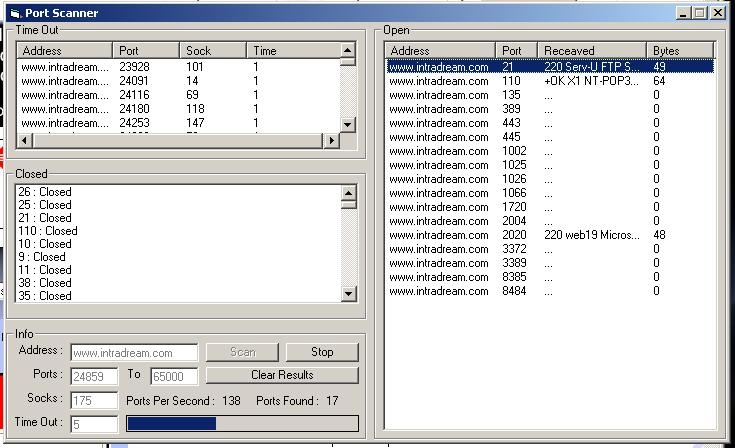



## Quick Port Scanner

### Description

Pretty Quick Port Scanner.. u can load up to 175 socks.. i made that max cause i can acuretly scan remote adreses at about 115 ports per sec on may cable inet . (win xp, xp 1700, 512mb) .. so im not sure how it will work on slower comps/inet.. has selectable timeout so u dont have to wait for winsock. , Timothy - IntraDream.com
 
### More Info
 

             |
---                |---
**Submitted On**   |2002-08-22 18:47:56
**By**             |[Timothy Marin](https://github.com/Planet-Source-Code/PSCIndex/blob/master/ByAuthor/timothy-marin.md)
**Level**          |Intermediate
**User Rating**    |4.8 (29 globes from 6 users)
**Compatibility**  |VB 6\.0
**Category**       |[Internet/ HTML](https://github.com/Planet-Source-Code/PSCIndex/blob/master/ByCategory/internet-html__1-34.md)
**World**          |[Visual Basic](https://github.com/Planet-Source-Code/PSCIndex/blob/master/ByWorld/visual-basic.md)
**Archive File**   |[Quick\_Port1213328222002\.zip](https://github.com/Planet-Source-Code/timothy-marin-quick-port-scanner__1-38195/archive/master.zip)

